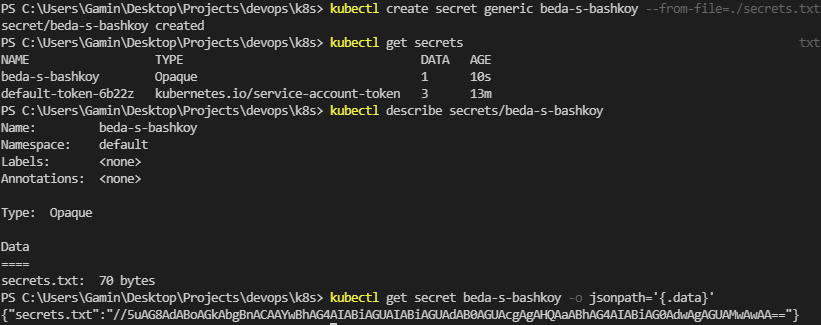
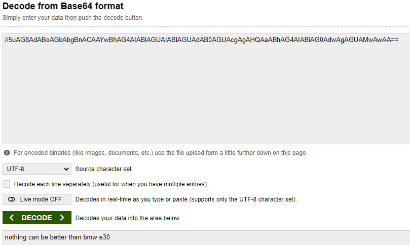

# K8s secrets and resources
1. Secret created
   1. 
2. Verified and decoded
   1. 
3. Helm secrets cannot be used within windows, and if I had a Linux system at hand, I would do as described here https://antonputra.com/helm-3-secrets-tutorial/
4. Already familliar with resource management, but got acquainted with what is available at the link
5. CPU and memory now are limited to 256mib and 100m for requests and limits