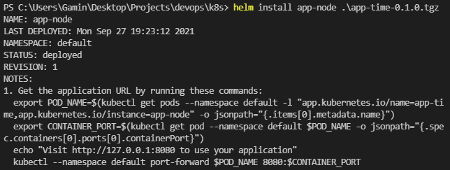
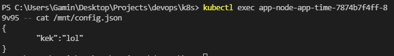

# K8s ConfigMaps

1. Read about ConfigMaps
2. Created a folder files with ```config.json``` file inside
3. Mounted successfully
   1. 
4. Output of the commands
   1. 
5. Followed the steps from lab