# K8s
1. Read about Kube Prometheus Stack:
2. This is the MD file
   1. AlertManager - used for alert handling
   2. Prometheus operator - used for automatic confuguration for kubernetes enviroment
   3. Prometheus - used to monitor and alert
   4. Prometheus Adapter for Kubernetes Metrics APIs - Kubernetes Metrics APIs implementation
   5. Prometheus node-exporter - used to pull OS metrics to show
   6. Grafana - used to monitor via GUI dashboards
   7. kube-state-metrics - used to generate Kubernetes API metrics
3. 
   1. 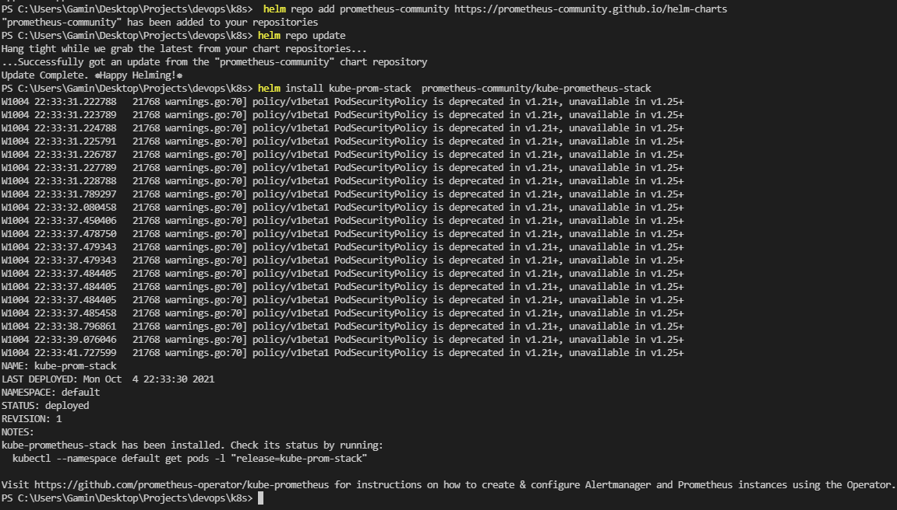
   2. 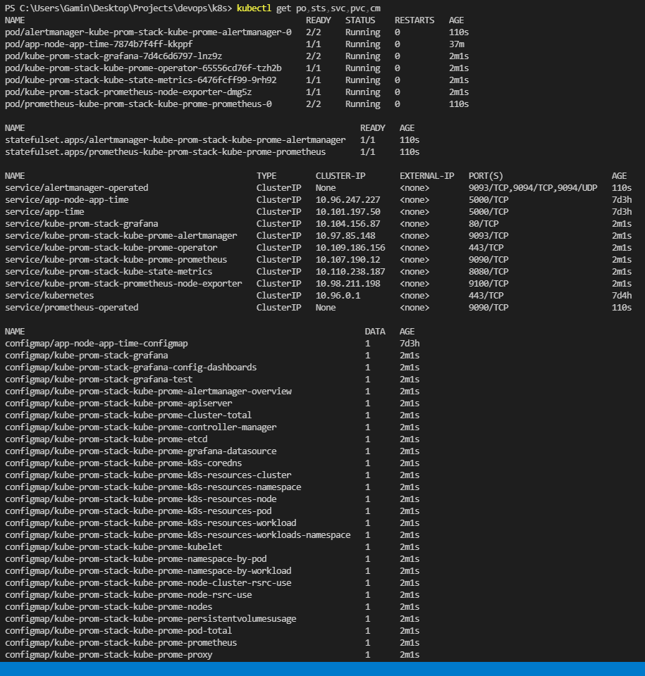
   3. 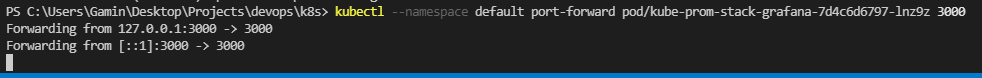
   4. 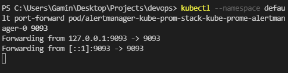
4. 
   1. 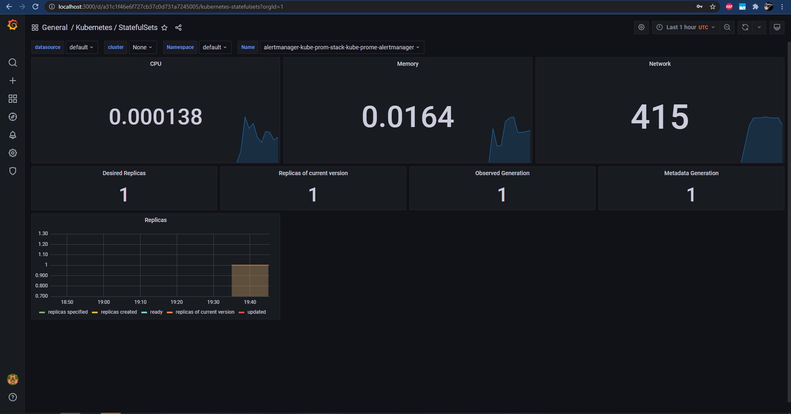
   2. 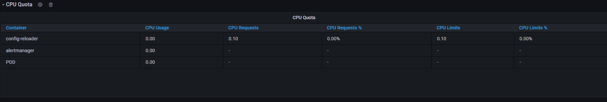
   3. 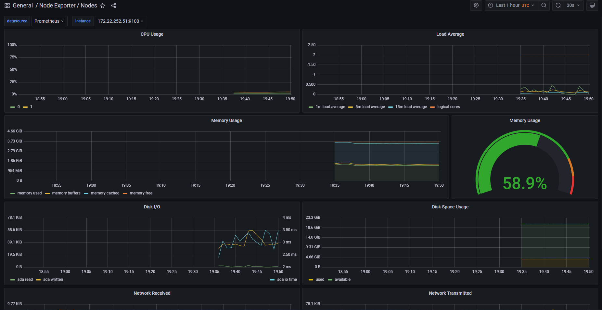
   4. 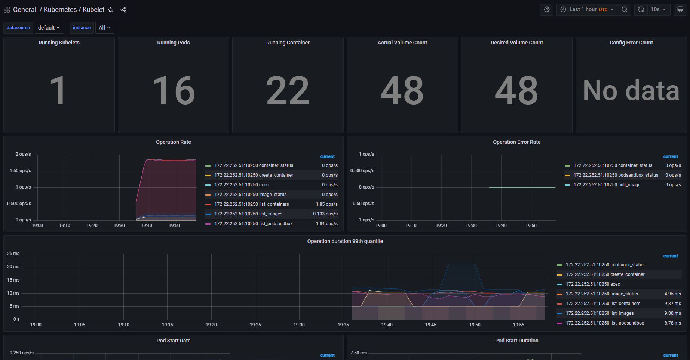
   5. 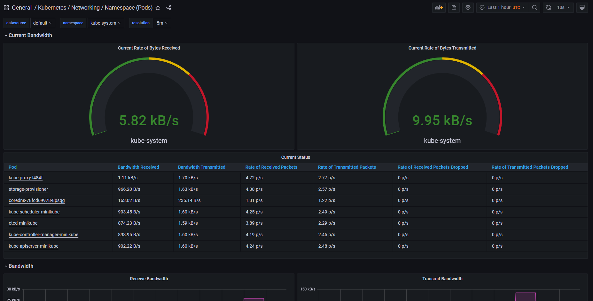
   6. 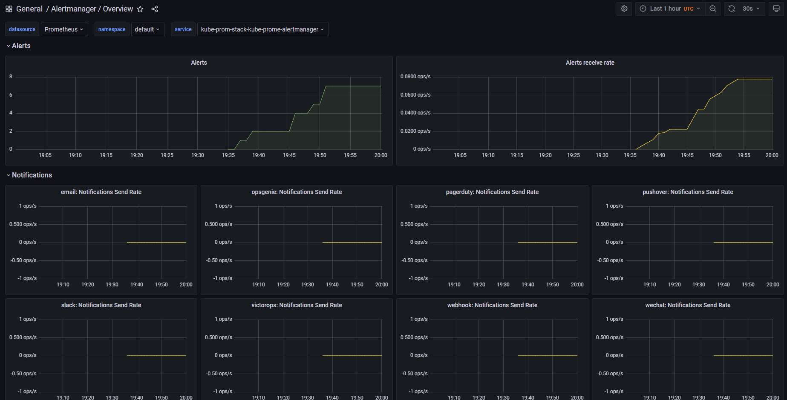
5. 
   1. 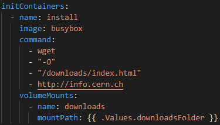
   2. 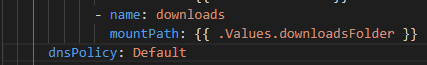
   3. 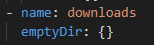
   4. Did not really understood
   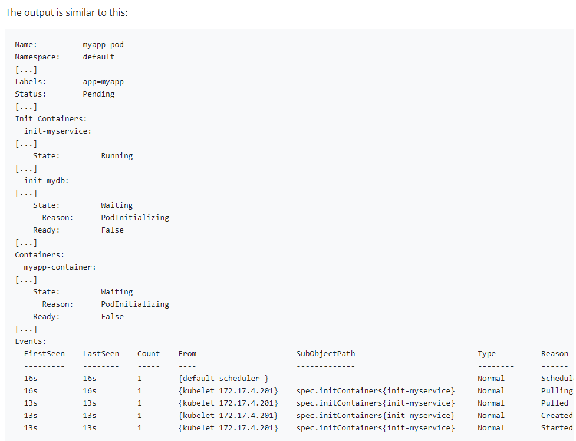
