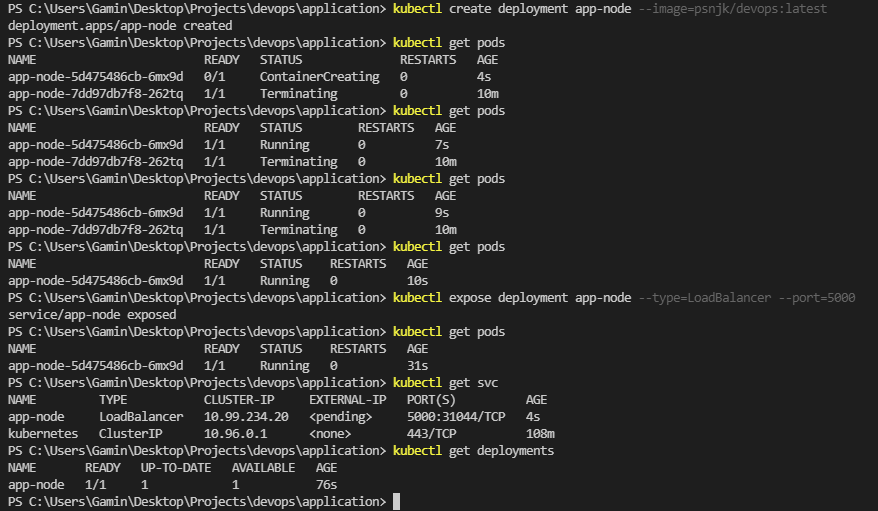
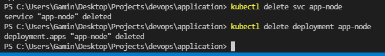
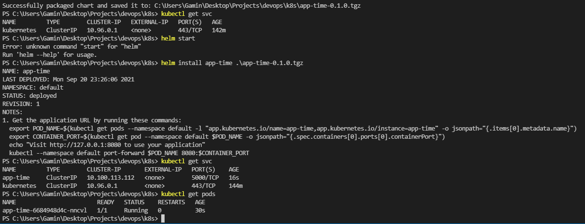
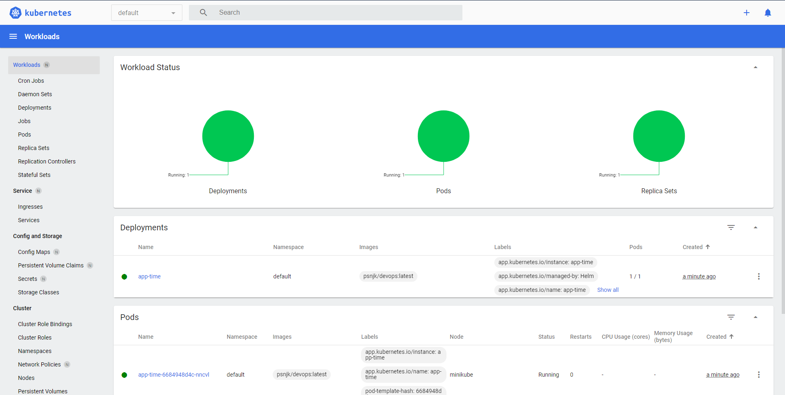

# k8s
## Kubernetes with minikube

1. Tutorials have been read
2. ```kubectl``` and minikube ```installed``` with ```chocolatey```
3. Application deployed (Screenshots are below)
   1. ```kubectl create deployment app-node --image=psnjk/devops:latest```
   2. ```kubectl get pods``` - to check it
4. Service is created and the app is accesible. (Screenshots are below)
   1. ```kubectl expose deployment app-node --type=LoadBalancer --port=5000```
   2. ```minikube service app-node```
5. Folder created and this is a readme with screenshots
   1. 
6. Cleaned up
   1. 
7. ```deployment.yml``` manifest is created
8. ```service.yml``` manifest is created
9. Files are provided, output is on the screenshots and in report

## Helm
1. Tutorials have been read
2. Helm installed
3. ```helm create app-time``` and values are changed (minukube dashboard is in use)
4. Helm chart is installed 
   1. 
   2. 
5. Checked! Output is provided on the screenshots