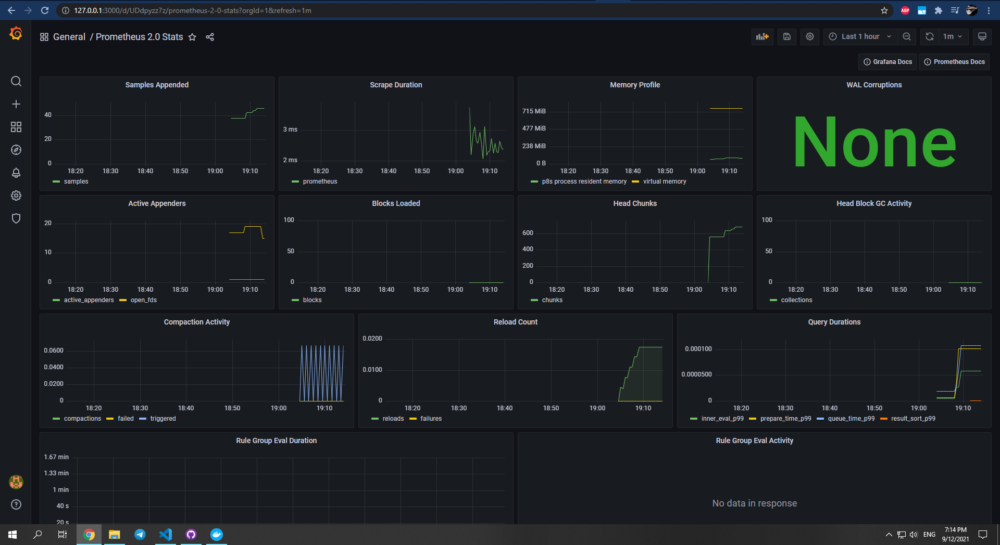

# Monitoring report
  
## Lab 7
```docker-compose.yaml``` includes 4 services:
- Python application
- Promtail
- Loki
- Grafana
  
Loki is configured in Grafana at localhost:3000 :

Logs example:


## Lab 8
### Internal docker logging with prometheus
Now ```docker-compose.yaml``` includes also ```prometheus``` service available at port ```9090```.
It uses ```host.docker.internal:9090``` for metrics.
Grafana Loki dashboard:

Prometheus docker logging:

Grafana Prometheus dashboard:

